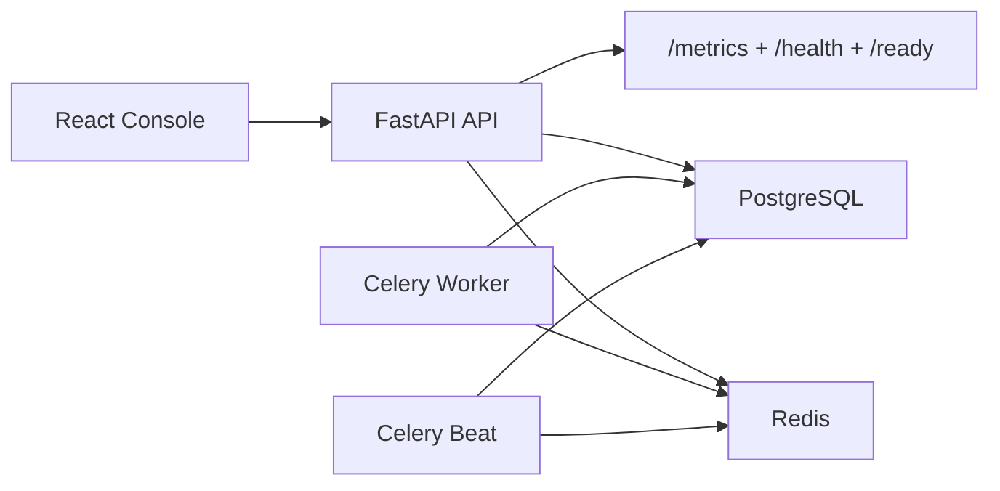

# SignalOps

SignalOps is a portfolio-grade incident, logging, alerting, and reliability analysis platform built to feel like an internal SRE product a real engineering organization would demo.

## Highlights

- FastAPI backend with layered services, async SQLAlchemy, structured logging, health checks, metrics, JWT auth, and RBAC
- PostgreSQL-backed registry, logs, incidents, alerts, and audit history with a swappable log storage boundary
- Redis + Celery worker/beat demo simulator for continuous log generation and escalation processing
- React + TypeScript + Vite frontend with Tailwind, shadcn-style primitives, Recharts, responsive dark-mode operations UI, and routed workflows
- Backend tests with Pytest, frontend unit tests with Vitest, Playwright smoke coverage, Docker/Compose, and GitHub Actions CI


## Architecture



## Product Capabilities

- Service registry with owner, environment, priority, and SLA metadata
- Log ingestion with severity, tags, metadata, anomaly scoring, and grouped fingerprints
- Incident clustering with timelines, root-cause hints, ownership, notes, and resolution controls
- Threshold alert rules with suppression, acknowledgement, escalation simulation, and audit history
- Reliability dashboards for incident count, MTTR, error rate, service health, and alert volume trends
- Search and filtering across logs and incidents
- Seeded demo services, alert rules, incident scenarios, and continuous simulator traffic

## Repository Layout

```text
SignalOps/
├── backend/                  FastAPI app, domain services, Celery tasks, tests
├── frontend/                 React console, tests, Playwright smoke
├── docs/screenshots/         README assets
├── docker-compose.yml        Full demo stack
└── .github/workflows/ci.yml  Backend + frontend CI
```

## Stack

- Backend: Python 3.12, FastAPI, SQLAlchemy, Celery
- Data: PostgreSQL, Redis
- Frontend: React 19, TypeScript, Vite, Tailwind CSS, Recharts
- Testing: Pytest, Vitest, Playwright
- Delivery: Docker, Docker Compose, GitHub Actions

## Demo Accounts

- `admin@signalops.dev` / `Admin123!`
- `sre@signalops.dev` / `Sre123!`
- `viewer@signalops.dev` / `Viewer123!`

## Local Development

### Backend

```bash
cd backend
python3 -m pip install -e '.[dev]'
uvicorn app.main:app --reload --port 8000
```

### Frontend

```bash
cd frontend
npm install
npm run dev
```

The frontend proxies `/api/*` to `http://localhost:8000` during development.

### Full Stack with Docker Compose

```bash
docker compose up --build
```

Endpoints:

- UI: `http://localhost:8080`
- API: `http://localhost:8000`
- OpenAPI docs: `http://localhost:8000/docs`
- Metrics: `http://localhost:8000/metrics`

## Testing

```bash
cd backend && pytest
cd frontend && npm run lint
cd frontend && npm run test:run
cd frontend && npm run build
cd frontend && npm run test:e2e
```

## Verification

- Backend API verified with `pytest` and live health/login/dashboard/incident endpoint checks
- Frontend verified with lint, unit tests, production build, Playwright smoke, and a real browser login flow against the live backend
- Docker assets are included for the full stack, and GitHub Actions reproduces the backend/frontend verification pipeline in CI

## Demo Scenarios

- `payment-api`: authorization timeouts and ledger persistence failures
- `identity-service`: auth burst failures and replica issues
- `fulfillment-engine`: queue backlog and dispatch confirmation delays
- `notification-worker`: delivery retry storms in staging

## Notes

- Log persistence is implemented in PostgreSQL for the prototype, but the ingestion flow routes through a dedicated storage abstraction so a specialized log store can be swapped in later.
- Celery beat continuously generates simulator traffic and processes alert escalations in the full Compose stack.
