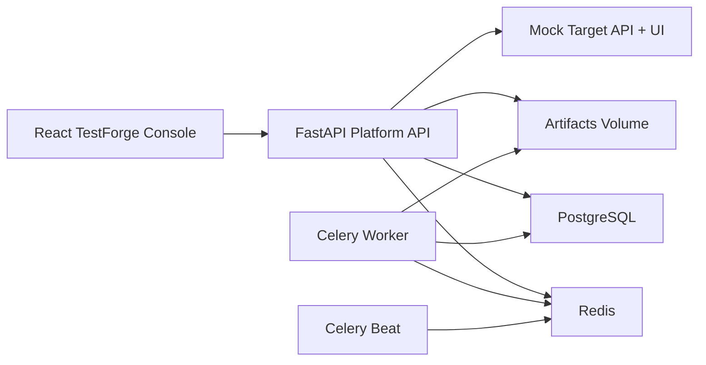

# TestForge

TestForge is a portfolio-grade QA automation management platform for API and UI testing. It models suites, fixtures, environments, schedules, runs, artifacts, alerts, and audit history as first-class platform concerns instead of treating automation as a loose folder of scripts.

## Why it feels production-grade

- FastAPI backend with async SQLAlchemy, JWT auth, validation-heavy request models, deterministic execution orchestration, audit logging, and artifact serving
- PostgreSQL for persistent state, Redis plus Celery for background execution and schedule polling, and shared artifact storage across API and worker containers
- React + TypeScript frontend with a premium dark/light dashboard, strong loading/empty/error states, reusable surface components, Recharts visualizations, and deep run drilldowns
- Seeded demo inventory with realistic projects, environments, fixture payloads, schedules, run history, synthetic alerts, and mock API/UI targets for portfolio walkthroughs
- Automated verification through backend Pytest, frontend Vitest, Playwright smoke coverage, Docker Compose, and GitHub Actions CI

## Feature set

- Project management for reusable automation domains
- Environment management across QA, staging, prod-like, and mock targets
- Fixture-set management with structured payloads
- Suite inventory for API and UI automation, owners, commands, tags, and case metadata
- Manual run launching plus schedule-driven execution
- Parallel worker simulation and deterministic flaky/failure modeling
- Dashboard reporting for pass-rate drift, runtime changes, flaky pressure, module hotspots, and run history
- Run details with UI screenshots, API request/response payloads, logs, stack traces, notifications, and runtime metadata
- Alert simulation and audit history for operational visibility
- Mock target API and mock target UI surfaces for demo execution

## Architecture



## Repository layout

```text
TestForge/
├── backend/                  FastAPI API, Celery tasks, domain models, tests
├── frontend/                 React dashboard, component tests, Playwright smoke
├── sample-tests/             Example Pytest and Playwright automation assets
├── docker-compose.yml        Full demo stack with health checks
├── Makefile                  Common local dev and verification commands
└── .github/workflows/ci.yml  CI pipeline
```

## Demo accounts

- `admin@testforge.dev` / `Admin123!`
- `qa.lead@testforge.dev` / `QaLead123!`
- `viewer@testforge.dev` / `Viewer123!`

## Quick start

### Local backend + frontend

```bash
cp .env.example .env
make backend-install
make frontend-install
```

Run the API:

```bash
make backend-dev
```

Run the UI in a second terminal:

```bash
make frontend-dev
```

The backend seeds demo data on startup. In local development, eager execution is enabled by default so manual runs complete inline without needing Redis or Celery.

### Full stack with Docker Compose

```bash
docker compose up --build
```

Key endpoints:

- UI: `http://localhost:8080`
- API: `http://localhost:8000`
- OpenAPI docs: `http://localhost:8000/docs`
- Health: `http://localhost:8000/api/v1/system/health`
- Readiness: `http://localhost:8000/api/v1/system/ready`
- Mock API target: `http://localhost:8000/api/v1/target-api/health`
- Mock UI target: `http://localhost:8000/api/v1/target-ui/checkout`

## Developer workflow

Common commands:

```bash
make test-backend
make test-frontend
make test-e2e
make test
```

What each stack expects:

- Backend reads `TESTFORGE_*` settings from `.env` or the shell.
- Frontend uses `VITE_API_BASE_URL`, defaulting to `/api/v1`.
- Artifacts are stored under `backend/artifacts/` locally and `/app/artifacts` in containers.

## Sample automation assets

API examples:

- `sample-tests/api/tests/test_checkout_api.py`
- `sample-tests/api/tests/test_identity_api.py`

UI examples:

- `sample-tests/ui/tests/checkout-journey.spec.ts`
- `sample-tests/ui/tests/admin-portal.spec.ts`

Ad hoc execution:

```bash
TARGET_BASE_URL=http://localhost:8000/api/v1/target-api pytest sample-tests/api/tests/test_checkout_api.py -m smoke
TARGET_UI_BASE_URL=http://localhost:8000/api/v1/target-ui npx playwright test sample-tests/ui/tests/checkout-journey.spec.ts
```

## Verification

Backend:

```bash
cd backend && pytest
```

Frontend:

```bash
cd frontend && npm run lint
cd frontend && npm run test:run
cd frontend && npm run build
cd frontend && npm run test:e2e
```

## Notes

- Celery beat polls active schedules every 30 seconds in the Compose stack and dispatches due runs to the worker.
- The execution engine is intentionally deterministic so seeded data stays stable across demos, screenshots, and portfolio review.
- Mock UI targets are styled to feel like real internal products, but they remain intentionally deterministic so Playwright and dashboard artifacts stay repeatable.
