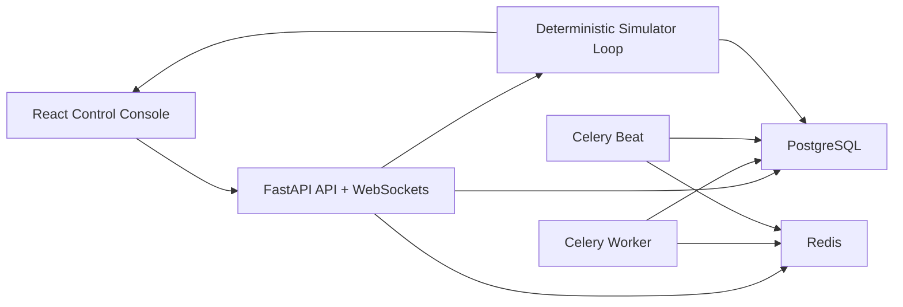

# RoboYard Control

RoboYard Control is a portfolio-grade realtime mission control platform for autonomous outdoor robots such as lawn mowers, utility carriers, and inspection bots. It simulates a live fleet moving through mapped operational zones while operators monitor telemetry, manage missions, acknowledge alerts, replay route history, and tune simulator policy from a serious dark-mode operations console.

## What Ships

- FastAPI backend with JWT auth, RBAC, OpenAPI docs, async SQLAlchemy models, structured errors, and modular services for auth, fleet, missions, alerts, history, dashboard analytics, config, audit, and simulator control
- Deterministic robot simulator with route progression, charging logic, weather pauses, obstacle events, collision-risk holds, low-battery return, connectivity degradation, and websocket fanout
- PostgreSQL + Redis + Celery architecture with Dockerized API, worker, beat, frontend, and local Compose orchestration
- React 19 + TypeScript + Vite frontend with Tailwind, shadcn-style primitives, Framer Motion, Recharts, a custom SVG yard map, robot detail drawer, mission composer, alert center, replay console, and admin surface
- Seeded demo zones, robots, live missions, historical telemetry, alerts, audit entries, and demo accounts for walkthroughs
- Backend tests with Pytest, frontend unit tests with Vitest, Playwright e2e coverage, and GitHub Actions CI

## Product Surface

- Authentication and roles: `admin`, `operator`, `viewer`
- Fleet registry: robot inventory, firmware, serials, zone assignment, status, and searchable fleet cards
- Live visualization: zones, charging stations, task areas, robot positions, alert overlays, and route tracks
- Telemetry streaming: battery, speed, position, connectivity, operating mode, mission progress, and weather state via WebSockets
- Mission control: create jobs, schedule windows, pause/resume, return to base, emergency stop, and manual override
- Alerts and incidents: low battery, obstacle, lost connectivity, weather safety, geofence breach, and collision risk with acknowledgment notes
- History and replay: mission event timeline, telemetry traces, route replay, and audit trail
- Admin/config: users, roles, thresholds, deterministic mode, weather toggles, and audit views

## Demo Profile

- 8 seeded robots across 4 operational zones
- Mixed robot states at startup: operating, charging, paused, manual override, idle, and scheduled
- Historical telemetry and replay trails for every robot
- Seeded alerts with open, acknowledged, and resolved lifecycle states
- Seeded audit entries for operator actions and policy changes

## Architecture



## Repository Layout

```text
RoboYardControl/
├── Makefile                  Common local commands
├── backend/                  FastAPI app, simulator, Celery tasks, tests
├── frontend/                 React console, unit tests, Playwright flows
├── docker-compose.yml        Full local stack
└── .github/workflows/ci.yml  Backend + frontend CI
```

## Demo Accounts

- `admin@roboyard.dev` / `Admin123!`
- `ops@roboyard.dev` / `Ops123!`
- `viewer@roboyard.dev` / `Viewer123!`

## Local Development

### Environment Files

```bash
cp backend/.env.example backend/.env
cp frontend/.env.example frontend/.env
```

The backend accepts `ROBOYARD_CORS_ORIGINS` as JSON or a comma-separated list for easier local setup.

### Backend

```bash
cd backend
python3 -m pip install -e '.[dev]'
uvicorn app.main:app --reload --port 8000
```

### Frontend

```bash
cd frontend
npm ci
npm run dev
```

The Vite dev server proxies `/api/*` to `http://localhost:8000`.

### Makefile Shortcuts

```bash
make backend-install
make frontend-install
make test
make lint
make typecheck
make build
```

### Full Stack with Docker Compose

```bash
docker compose up --build
```

Endpoints:

- UI: `http://localhost:8080`
- API: `http://localhost:8000`
- OpenAPI docs: `http://localhost:8000/docs`
- Metrics: `http://localhost:8000/metrics`

Compose now includes health checks for PostgreSQL, Redis, backend, and frontend services so the stack comes up in a more predictable order.

## API and Module Boundaries

- `backend/app/api/routes`: auth, fleet, missions, alerts, history, config, dashboard, audit, simulator, system
- `backend/app/services`: orchestration and business logic for simulator control, mission commands, dashboard aggregation, demo seeding, and audit logging
- `backend/app/schemas`: strongly typed request and response contracts with validation for geometry, mission scheduling, alert notes, config thresholds, and nested summaries
- `frontend/src/pages`: landing, login, console, fleet, missions, alerts, history, admin
- `frontend/src/components`: app shell, analytics cards, status primitives, yard visualization, robot drawer, and reusable loading/empty/error states

## Verification

Commands executed in this workspace:

```bash
cd backend && python3 -m pytest tests -q
cd frontend && npm run lint
cd frontend && npm run test:run
cd frontend && npm run build
cd frontend && npm run test:e2e
```

Observed results:

- Backend tests passed: `10 passed`
- Frontend lint passed
- Frontend unit tests passed: `5 passed`
- Frontend production build passed
- Playwright e2e passed: `6 passed`

## Notable Implementation Notes

- The backend defaults to PostgreSQL/Redis for real deployment but supports SQLite in tests for fast local verification.
- The simulator runs inside the FastAPI app lifecycle for realtime demo streaming, while Celery is reserved for background rollups and periodic jobs.
- The frontend websocket layer updates React Query caches in place so the control console visibly changes without page refreshes.
- Demo seed data is deterministic, which makes dashboard walkthroughs and replay sessions stable across runs.
- The repo was cleaned of detached legacy SignalOps-era service, incident, and logging modules so the architecture now maps cleanly to the robotics product surface.
